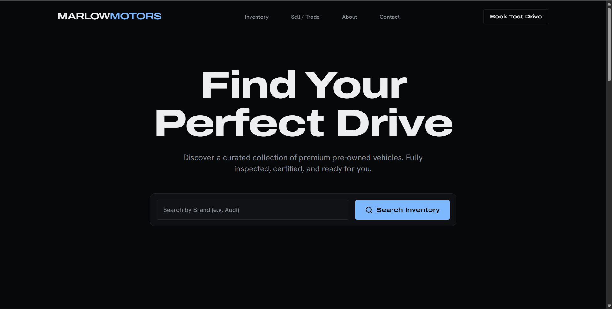
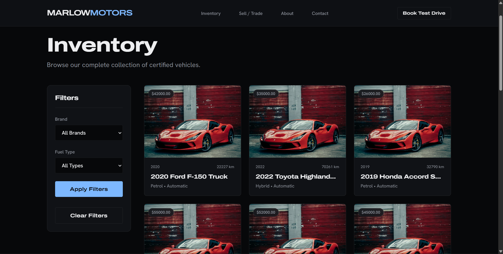
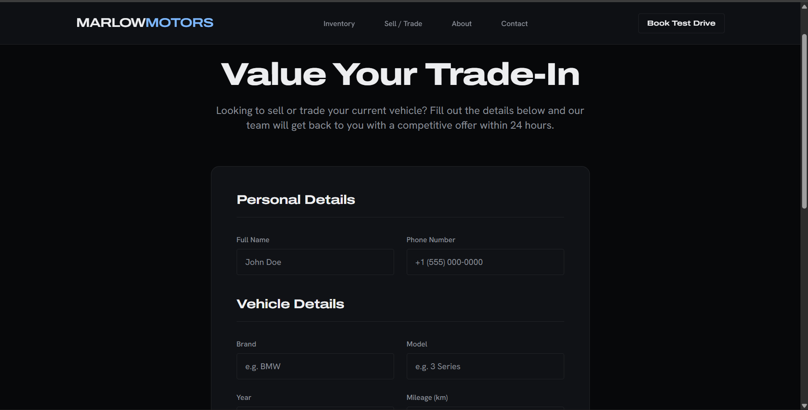
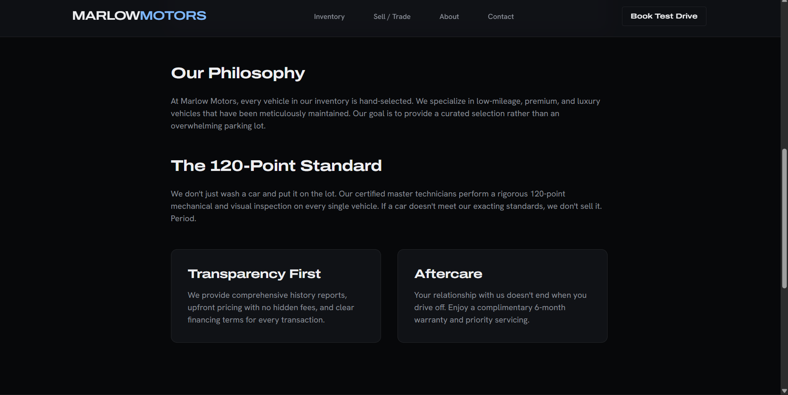
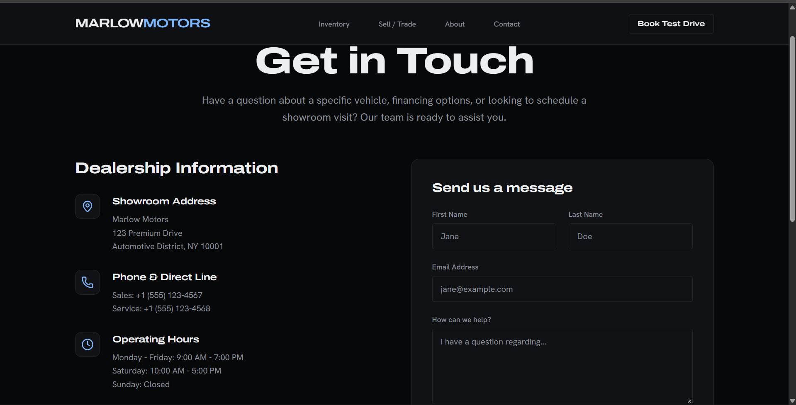

> **Note**: This repository is just a template / demo project designed to showcase a modern, premium car dealership platform.

<div align="center">
  <br />
  <h1>🏎️ Marlow Motors - Dealership Template</h1>
  <p>
    A high-end, cinematic, and mobile-first digital showroom built with Django and Tailwind CSS.
  </p>
  <p>
    <a href="#features"><strong>Explore the Features</strong></a> · 
    <a href="#installation"><strong>Installation Guide</strong></a> · 
    <a href="#screenshots"><strong>View Screenshots</strong></a>
  </p>
</div>

---

## 📖 Overview

Marlow Motors is a premium template designed for high-end car dealerships. It ditches the cluttered, classifieds-style design common in the automotive industry in favor of a sleek, dark-themed, and cinematic user experience. Built with a robust **Django** backend and a beautiful **Tailwind CSS v4** frontend, this platform is optimized for performance, SEO, and lead generation.

---

## ✨ Key Features

- 📱 **Mobile-First & Responsive**: flawless experience across all devices, ensuring customers can browse inventory comfortably on their phones.
- 🎨 **Premium Cinematic UI**: A dark theme, utilizing Apple/Samsung style product-launch aesthetics, clean typography (Archivo & Hanken Grotesk), and subtle micro-animations.
- 🚗 **Dynamic Inventory System**: Filter, sort, and paginate through a managed database of vehicles seamlessly.
- 📊 **Interactive EMI Estimator**: Built-in financing calculator via Alpine.js on the car detail page.
- 📸 **Beautiful Media Galleries**: Splide.js integrated image carousels for showcasing vehicles.
- 📈 **Lead Generation Engine**: Integrated "Sell/Trade-in" and "Enquiry" forms packed with honeypot spam protection.
- 🛠️ **Custom Dealership Admin**: A highly customized, user-friendly Django Admin portal for dealership staff to manage cars, images, and leads quickly.

---

## 💻 Tech Stack

- **Backend**: Python, Django 4.2+, SQLite (Development), PostgreSQL (Production ready)
- **Frontend**: HTML5, Tailwind CSS v4 (CDN), Alpine.js, Splide.js, Lucide Icons
- **Production / DevOps**: Gunicorn, WhiteNoise, dj-database-url

---

## 📸 Screenshots

### 1. The Digital Showroom


### 2. Vehicle Details & EMI Estimator


### 3. Inventory Filters


### 4. Valuation & Trade-In Form


### 5. Custom Django Admin Dashboard


---

## 🚀 Installation & Local Setup

Want to run this demo locally? Follow these simple steps:

### Prerequisites
- Python 3.10+
- Git

### Steps

1. **Clone the repository**
   ```bash
   git clone https://github.com/jaineesh-kumar/car_dealership.git
   cd car_dealership
   ```

2. **Create a Virtual Environment & Install Dependencies**
   ```bash
   python -m venv venv
   source venv/bin/activate  # On Windows use: .\venv\Scripts\activate
   pip install -r requirements.txt
   ```

3. **Environment Variables**
   Rename `.env.example` to `.env` and fill in your local development values.
   ```bash
   cp .env.example .env
   ```

4. **Run Migrations & Seed the Database**
   Set up the database and populate it with 20 sample vehicles automatically!
   ```bash
   python manage.py migrate
   python manage.py seed_cars
   ```

5. **Create a Superuser** (To access the admin panel)
   ```bash
   python manage.py createsuperuser
   ```

6. **Start the Development Server**
   ```bash
   python manage.py runserver
   ```
   *Visit `http://127.0.0.1:8000/` to view the site, and `http://127.0.0.1:8000/admin/` to manage it.*

---

## 📦 Deployment (Render / Heroku)

This project is fully production-hardened. It includes a `build.sh` script, `gunicorn`, and `WhiteNoise` for static file serving. 
Simply connect the repository to your hosting provider, specify `build.sh` as the build command, and `gunicorn config.wsgi:application` as the start command.

---

## 📝 License

This is a demo template repository provided for educational and template usage purposes.